# Nature & Terrain (`nature-kit`)

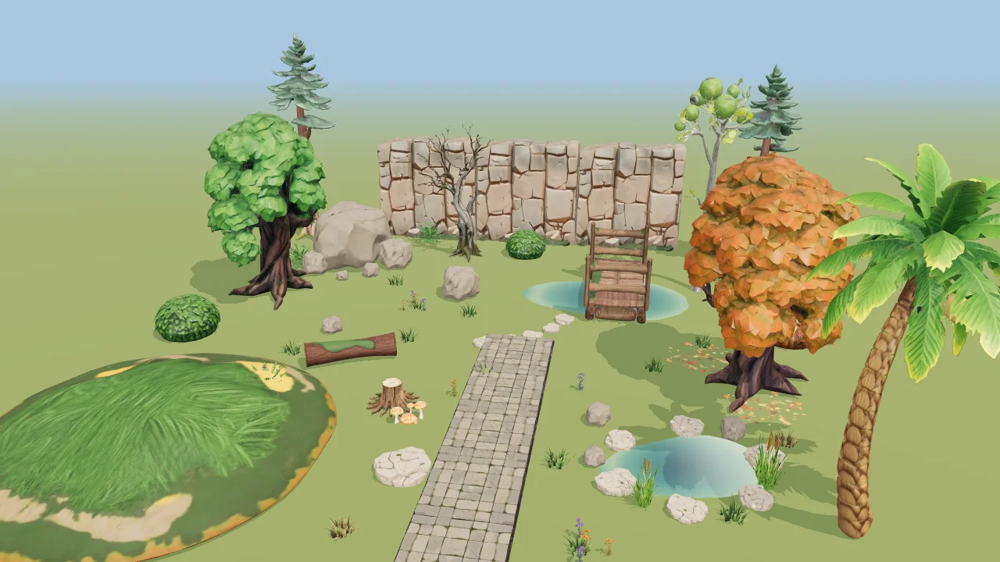

What an outdoor level needs, in one pack: trees, bushes, grass and ferns, flowers, rocks
from pebble to boulder cluster, a modular cliff wall, a stone path tile, a log and a stump,
toadstools, a pond with its rocks and reeds, a footbridge, a walkable mound and a
fallen-leaves decal. **31 items**, all real-world scale in metres, all one mesh + one
material (one draw call each; kitbashed groups are one call per part).

**Style.** The round-3 house style: "stylized realistic" game-ready PBR — clean readable
shapes, slightly chunky proportions, painted textures with real roughness variation, the
warm natural palette (moss, bark, sandstone, slate) shared with the architecture and props
kits, no baked lighting. **The accent colour is amber** (autumn oak and bush, amber
wildflowers, orange toadstools, the leaves decal); violet appears once, as the second
flower colour.

**License.** © theprototype, [CC0 1.0](https://creativecommons.org/publicdomain/zero/1.0/).
Made with [Meshy.ai](https://www.meshy.ai) (paid plan) and post-processed here; see
`attribution.html`.

## Grid, scale and pivots

| piece | size (m) | pivot | how it snaps |
|---|---|---|---|
| **Stone Path Tile** | 2 × 0.15 × 2 | bottom-centre | 1 m grid: put the centre on **odd** metres (1, 3, 5 …) and the 2 m edges land on grid lines; tiles laid 2 m apart meet with **0 mm** gap (measured in the e2e) |
| **Cliff Wall (modular)** | 4 × 4 × 1.5 | **bottom-centre-back** | chunks 4 m apart along a line tile horizontally with 0 mm gap; the back face sits ON the placement line, so a row of chunks is flush along a wall/level edge. Rotate 90° steps for corners |
| **Grassy Mound** | 8 × 1.2 × 8 | bottom-centre | walkable: see the slope table below |
| everything else | see the table | bottom-centre | origin = where it touches the ground, so a drop on terrain stands it up |

Snapping in the app (Configure Scene ▸ Snapping, translate 1 m) lands a dragged piece on
the grid — the e2e drags a path tile by its gizmo and checks it (and peer B's copy) land
on whole metres.

**Walkable mound.** `build/slope.mjs` on the shipped Hill (8 × 1.2 × 8 m): of its 56 m² of up-facing surface **59 % is under 20°, 94 % under 30°** (7 % 0-10°, 52 % 10-20°, 27 % 20-25°, 7 % 25-30°, 2 % 30-35°, 3 % 35-45°, 2 % steeper — the rim where it meets the ground). A standard character controller (45° limit) walks all of it.

## Items

<!-- items:begin (build/kitmd.mjs) -->
| item | kind | tris | size x × y × z (m) | GLB |
|---|---|---:|---|---:|
| 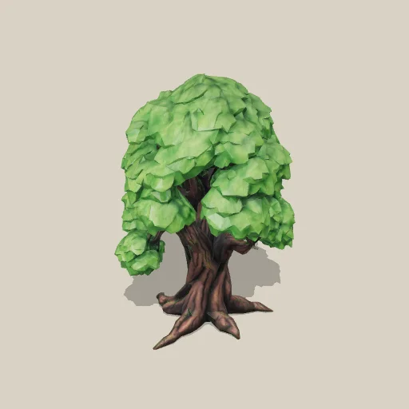 **Oak Tree** `Oak` | Meshy (graded) | 12,518 | 3.75 × 6.00 × 3.97 | 1.43 MB |
| 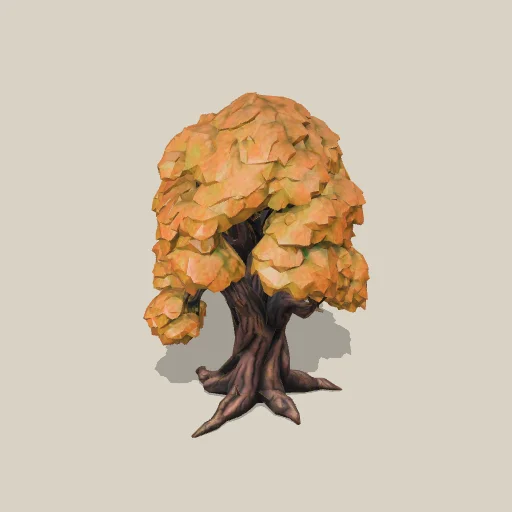 **Oak Tree (autumn)** `OakAutumn` | grade of Oak | 12,518 | 3.75 × 6.00 × 3.97 | 1.45 MB |
| 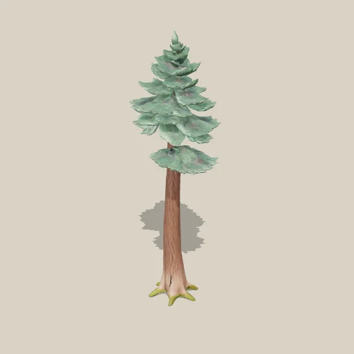 **Pine Tree** `Pine` | Meshy (graded) | 8,999 | 2.60 × 8.00 × 2.50 | 1.22 MB |
| 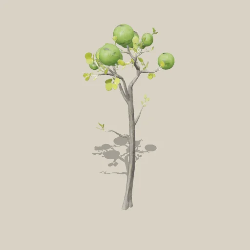 **Birch Tree (young)** `Birch` | Meshy (graded) | 9,188 | 2.51 × 7.00 × 2.69 | 1.06 MB |
| 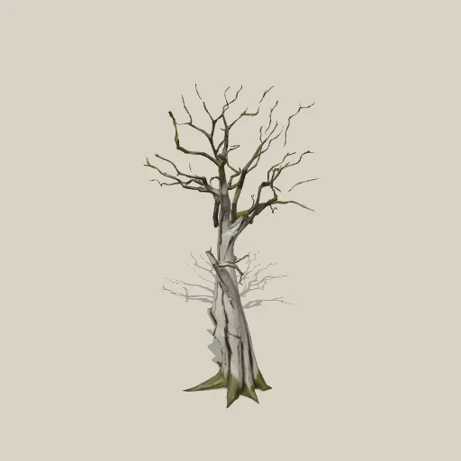 **Dead Tree** `DeadTree` | Meshy (graded) | 5,999 | 2.92 × 5.00 × 2.94 | 1.06 MB |
| 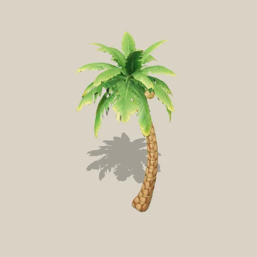 **Palm Tree** `Palm` | Meshy (graded) | 7,999 | 3.94 × 7.00 × 4.07 | 1.07 MB |
| 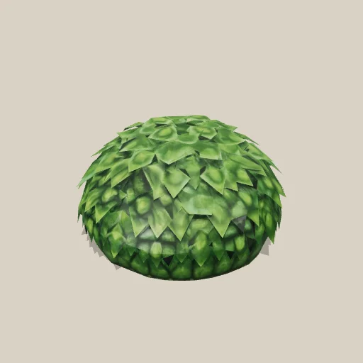 **Bush** `Bush` | Meshy (graded) | 2,828 | 1.86 × 1.10 × 1.87 | 786 KB |
| 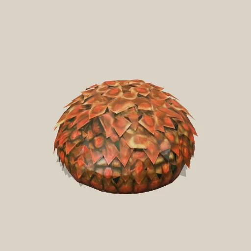 **Bush (autumn)** `BushAutumn` | grade of Bush | 2,828 | 1.86 × 1.10 × 1.87 | 799 KB |
| 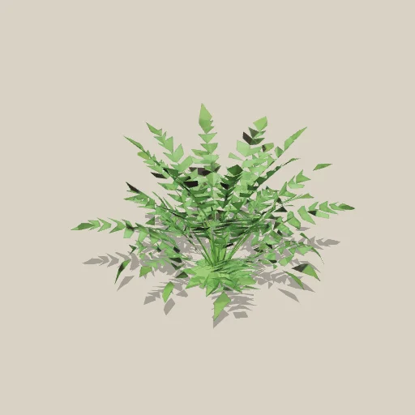 **Fern** `Fern` | Meshy (graded) | 2,126 | 1.17 × 0.80 × 1.16 | 867 KB |
| 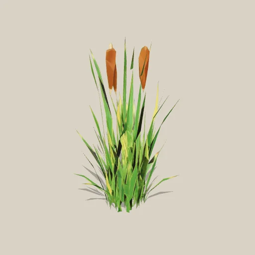 **Reeds (cattails)** `Reeds` | Meshy | 1,453 | 0.80 × 1.30 × 0.85 | 771 KB |
| 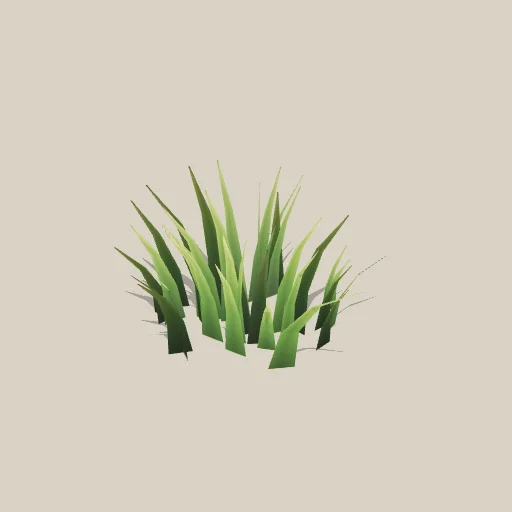 **Grass Tuft** `GrassTuft` | procedural (grass.mjs) | 240 | 0.74 × 0.38 × 0.68 | 14 KB |
| 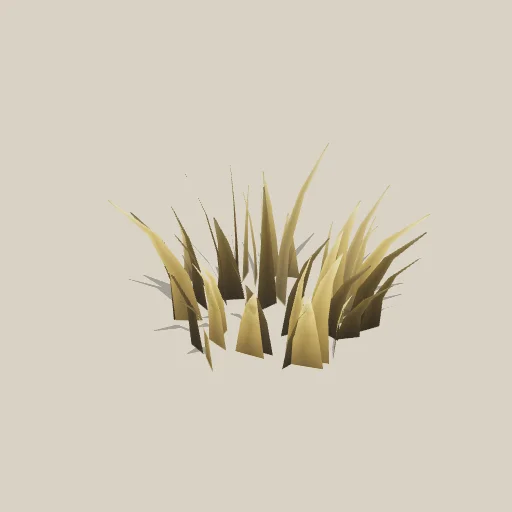 **Grass Tuft (dry)** `GrassTuftDry` | procedural (grass.mjs) | 240 | 0.55 × 0.31 × 0.59 | 14 KB |
| 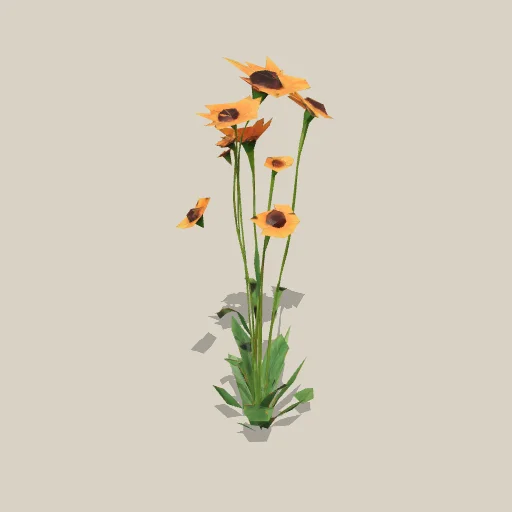 **Wildflowers (amber)** `Flowers` | Meshy (graded) | 1,583 | 0.15 × 0.50 × 0.20 | 650 KB |
| 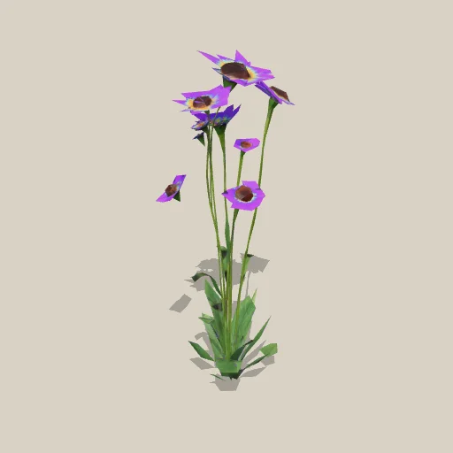 **Wildflowers (violet)** `FlowersViolet` | grade of Flowers | 1,583 | 0.15 × 0.50 × 0.20 | 676 KB |
| 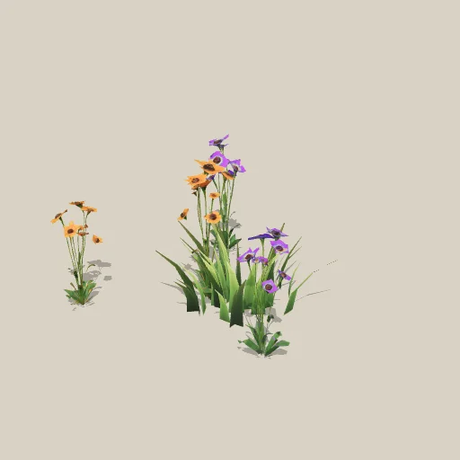 **Flower Patch** `FlowerPatch` | kitbash (Flowers, FlowersViolet, GrassTuft) | 6,572 | 0.81 × 0.50 × 0.76 | 934 KB |
| 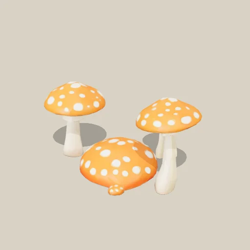 **Mushroom Cluster** `Mushrooms` | Meshy | 2,412 | 0.86 × 0.45 × 0.57 | 493 KB |
| 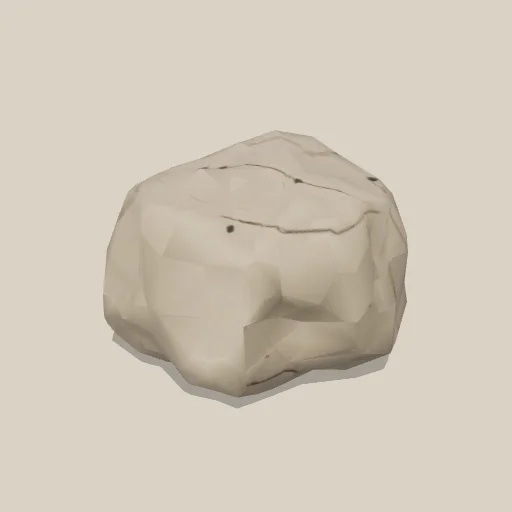 **Rock (small)** `RockSmall` | Meshy (graded) | 700 | 0.60 × 0.45 × 0.58 | 200 KB |
| 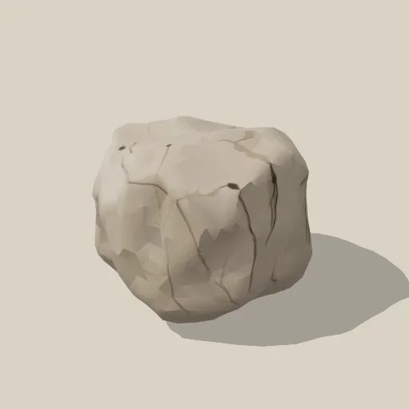 **Rock (medium)** `RockMedium` | size of RockSmall | 1,500 | 1.32 × 1.00 × 1.28 | 224 KB |
| 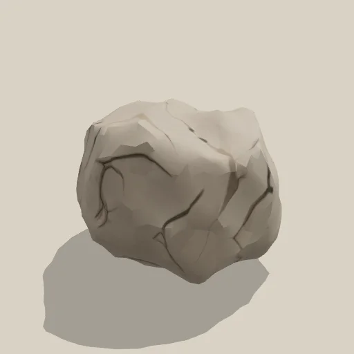 **Rock (large)** `RockLarge` | size of RockSmall | 1,500 | 2.90 × 2.20 × 2.82 | 224 KB |
| 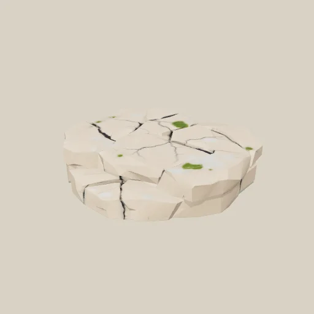 **Flat Rock** `FlatRock` | Meshy | 1,200 | 1.20 × 0.25 × 1.16 | 432 KB |
| 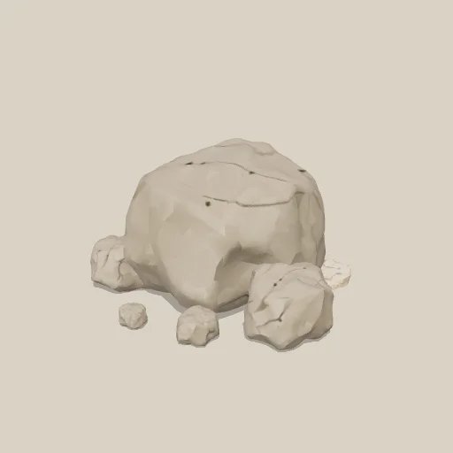 **Boulder Cluster** `BoulderCluster` | kitbash (RockLarge, RockMedium, RockSmall, FlatRock) | 7,100 | 3.96 × 2.20 × 3.48 | 725 KB |
| 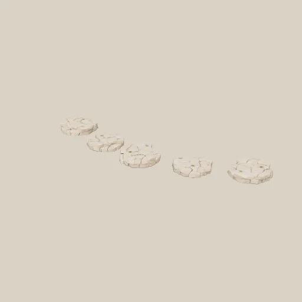 **Stepping Stones** `SteppingStones` | kitbash (FlatRock) | 6,000 | 3.50 × 0.13 × 1.08 | 433 KB |
| 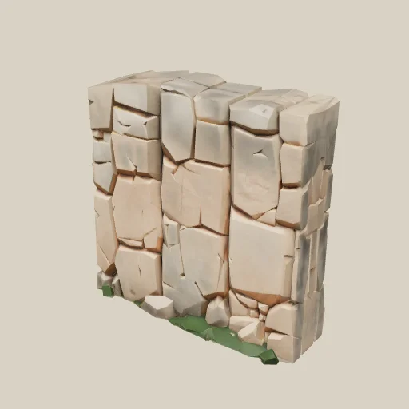 **Cliff Wall (modular 4 m)** `Cliff` | Meshy (graded) | 4,039 | 4.00 × 4.00 × 1.50 | 709 KB |
| 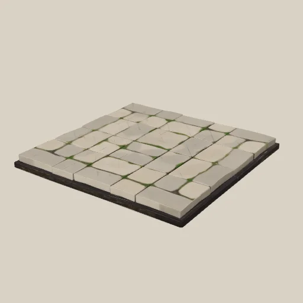 **Stone Path Tile (2×2 m)** `PathTile` | Meshy (graded) | 1,832 | 2.00 × 0.15 × 2.00 | 479 KB |
| 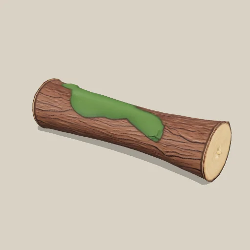 **Fallen Log** `Log` | Meshy (graded) | 2,500 | 2.50 × 0.69 × 0.70 | 453 KB |
| 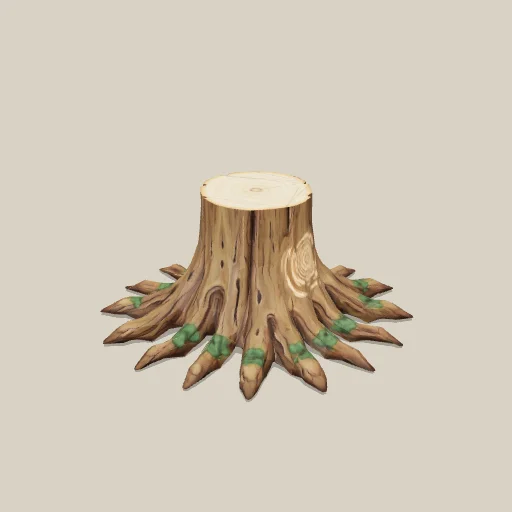 **Tree Stump** `Stump` | Meshy (graded) | 2,585 | 1.31 × 0.60 × 1.31 | 632 KB |
| 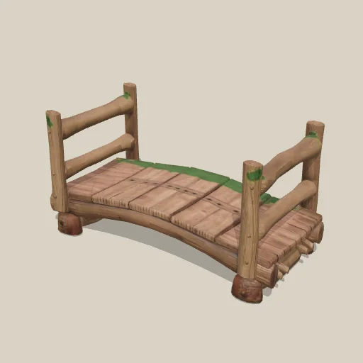 **Wooden Footbridge** `Bridge` | Meshy (graded) | 5,000 | 4.00 × 2.06 × 2.00 | 645 KB |
| 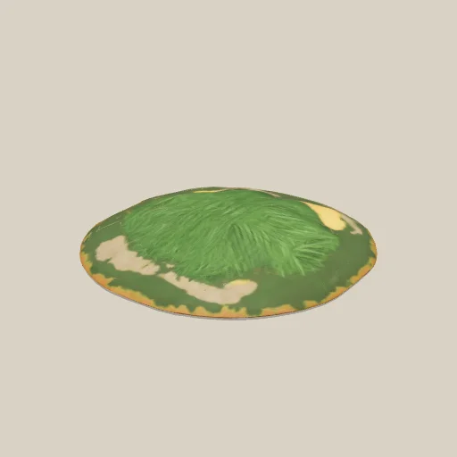 **Grassy Mound (8×8 m, walkable)** `Hill` | Meshy (graded) | 1,364 | 8.00 × 1.20 × 8.00 | 530 KB |
| 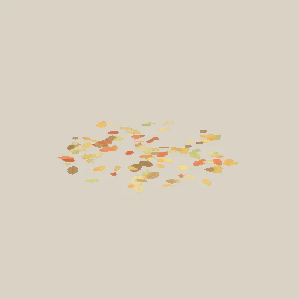 **Fallen Leaves (decal 2×2 m)** `FallenLeaves` | procedural (leaves.mjs) | 2 | 2.00 × 0.00 × 2.00 | 65 KB |
| 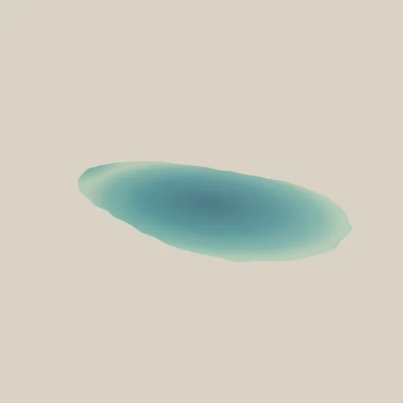 **Pond Water** `PondWater` | procedural (water.mjs) | 48 | 3.62 × 0.00 × 2.21 | 7 KB |
| 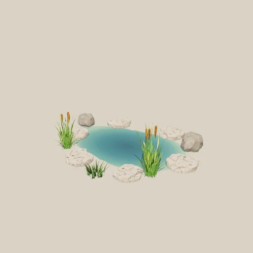 **Pond with Rocks & Reeds** `PondSet` | kitbash (PondWater, FlatRock, RockSmall, Reeds, GrassTuft) | 11,794 | 4.32 × 1.30 × 3.79 | 1.39 MB |

All 31 GLBs together: 20.2 MB; the largest is 1483 KB (share cap 5 MB, aim 2 MB); the heaviest tree 12,518 tris (budget 15k).
<!-- items:end -->

**Kinds.** *Meshy* — a Meshy.ai text-to-3D preview (5 cr) refined to PBR (10 cr), then
post-processed. *grade* — the same mesh as its Meshy parent with a 0-credit colour grade of
the base-colour texture (hue-range shift, feathered, value-preserving). *size* — the same
mesh at another size (0 cr). *kitbash* — built items merged into one GLB with instanced
parts (0 cr). *procedural* — a script in `build/` (0 cr).

## Budget

**300 credits allotted, 275 spent, 25 left** (the ledger, requester `30c-pack-nature`), for **18 Meshy meshes** → 31 items:

| | credits |
|---|---:|
| 18 kept meshes × (preview 5 + refine 10) | 270 |
| t2 previews lost to Meshy's t2 outage (hill, cliff ×2, flat rock; re-issued on meshy-6-lite, counted above) — FAILED, refunded | 0 |
| 1 rejected preview (the first bush: scattered leaf shards) | 5 |
| **retextures** | **0** — every colour variant is a grade (OakAutumn, BushAutumn, FlowersViolet) |
| size variants, kitbashes, procedural | 0 |

Cost per shipped item: 275 / 31 ≈ **8.9 credits**. 13 of the 31 items cost nothing beyond their parent mesh.

## How it was made (and how to rebuild it)

```
tools/meshy (the budget lane's tool)          jobs in build/jobs/*.json, --requester 30c-pack-nature
  preview (t2 / meshy-6-lite) → LOOK (build/render.mjs look) → refine the keepers
build/finalize.mjs [--only Oak,Pine]           staging → cut base disc → meshy-post (weld, simplify,
                                               scale, pivot, 1024² JPEG) → drop emissive → grade
                                               → thumb.webp → default.json
build/cover.mjs                                cover.webp + cover-wide.webp (the e2e clearing, offline)
build/slope.mjs Hill/glTF-Binary/Hill.glb      walkability of a terrain piece
build/e2e-clearing.cjs                         the in-app proof (see its header)
```

Everything under `build/` reads the Meshy outputs from the tool's staging folder; the GLBs
in this pack are the product and are what the app loads.

## Post-processing, every asset

- weld, simplify to the budget (trees ≤ 12.5k tris, props 0.2-5k), one mesh, one material;
- scale to real-world size, pivot per the table above, node transforms baked;
- textures 1024² JPEG (base colour, metal-rough, normal); **no Draco/Meshopt/KTX2/WebP**
  — the app's Explorer preview and scene-sync receiver use a bare GLTFLoader;
- Meshy's **emissive map dropped** (the oak's canopy came back with a non-black emissive
  that made it glow; nothing in nature emits light);
- the **base disc cut away** where Meshy stood a plant on one (bush, flowers, mushrooms,
  the mound's lip): triangles lying wholly below 4-10 % of the height;
- **colour grading** where a refine came back lime, neon or chalk-white (oak and bush
  canopies, palm, log moss, rocks, path stones, dead wood) and for the 0-credit variants;
- Meshy's own generator/extras metadata kept (Meshy ToS §2.4).

## Known limits

- **Solid stylised canopies, no alpha leaf cards.** Meshy's output has no alpha, so the
  trees are sculpted canopies (≤ 12.5k tris). The procedural pieces (grass, leaves decal)
  are where alpha/thin geometry lives.
- **The birch** is a young, lollipop-canopy birch: Meshy gave round leaf puffs and painted
  them with bark; the grade swaps the two (pale trunk, green puffs).
- **Cliff seams**: chunks meet exactly (bounding boxes flush), but the rock faces are not
  continuous across the join — overlap two chunks by 0.2-0.5 m, or alternate a 180°-rotated
  one, when a seam shows.
- **Pond water** is a flat alpha-blended surface (no animated shader), 2 cm above ground.
